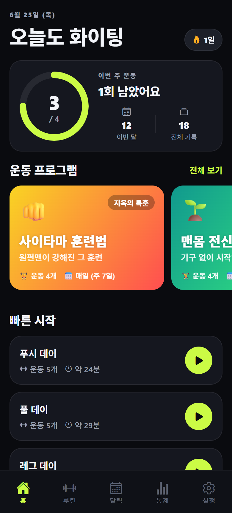
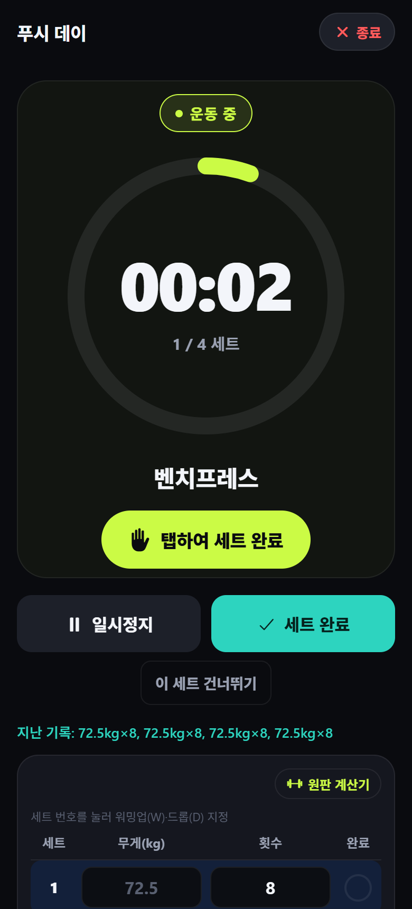
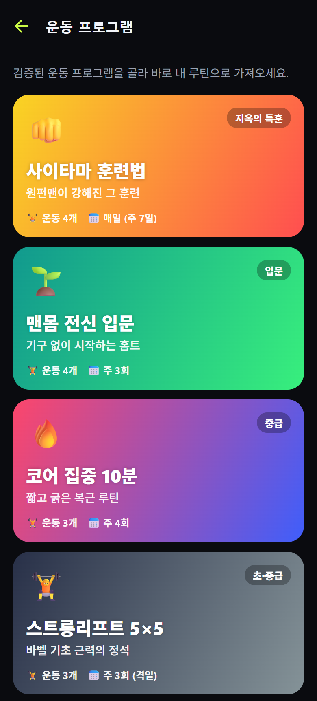
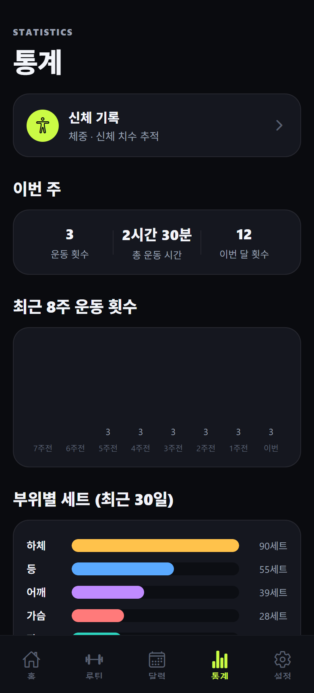
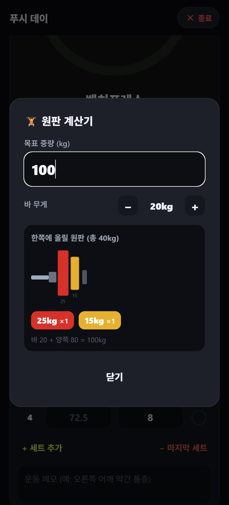
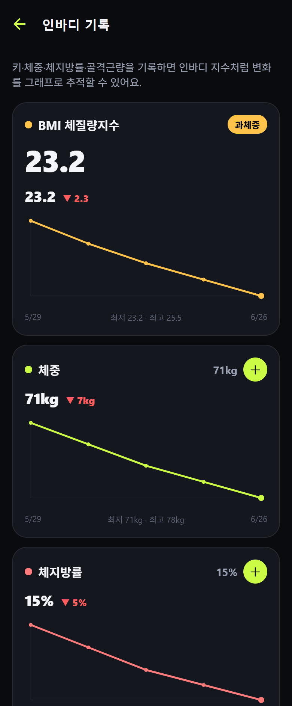
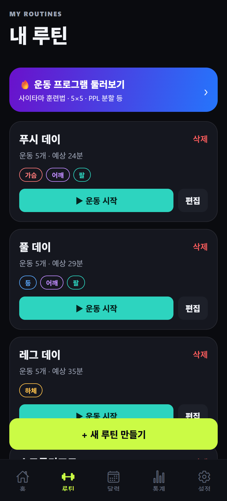
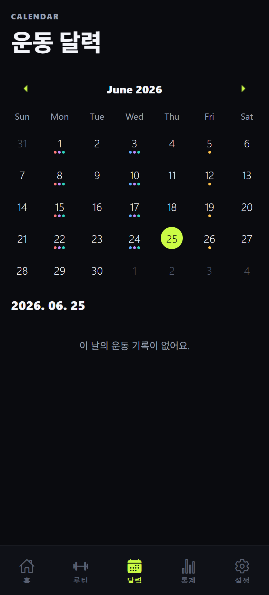

# 🏋️ 헬스 기록 앱 (Fitness Tracker)

운동 루틴을 만들고, **준비 → 운동 → 휴식 타이머**로 세트를 진행하며, 세트별 무게·횟수·RPE를 기록하고, 달력·통계·신체 변화까지 한곳에서 관리하는 모바일 운동 기록 앱입니다.

서버·계정 없이 **기기 안에서만 동작하는 오프라인 앱**이며, 다크 테마 한국어 UI로 만들어졌습니다.

<p>
  
  
  
  
  
</p>

---

## ✨ 주요 기능

### 루틴 · 운동
- **루틴 CRUD** — 생성/수정/삭제, 운동 순서 변경, 세트 수·운동시간·휴식시간 설정
- **운동 계획(플래너)** — 루틴을 골라 **달력에서 날짜를 직접 선택**해 나만의 프로그램 구성. 달력에 예정 표시(예정/오늘/완료/놓침), 홈에 "오늘의 계획" 카드에서 바로 시작
- **운동 DB** — 부위·기구·**브랜드** 필터, 기본 운동 40여 종 + 커스텀 운동 추가(중복 검사)
- **브랜드 머신** — 유명 외산 브랜드의 대표 머신 80여 종 내장(유산소 장비 포함): 해머스트렝스(아이소레터럴) · 라이프피트니스 · 파나타(핵/벨트 스쿼트) · 아스날 · 뉴텍(V-스쿼트) · 테크노짐(스킬밀) · 사이벡스(아크 트레이너) · 노틸러스(풀오버) · **프리코(EFX/AMT) · 매트릭스(클라임밀) · 우드웨이(커브) · 콘셉트2(로잉/바이크/스키 에르그)** — 브랜드로 필터해서 선택
- **기구 직접 추가** — 커스텀 운동 생성 시 브랜드를 목록에서 고르거나 **직접 입력** 가능. 새 브랜드는 자동으로 브랜드 필터에도 추가됨
- **유산소 지원** — 유산소 운동은 **시간·거리 기반**으로 기록: 세트 완료 시 스톱워치 경과 시간이 자동 저장되고 거리(km)를 함께 남길 수 있음. 종목 12종(러닝머신·야외 러닝·걷기·스텝밀·스피닝·수영·줄넘기·등산 등) + 통계에 최근 30일 유산소 요약(횟수·총 시간·총 거리·평균 심박)
- **Apple Watch 심박·거리 자동 기록** — 워치(HealthKit)가 있으면 유산소 세트 완료 시 해당 구간의 **평균 심박(bpm)과 이동 거리를 자동으로** 채움. 워치가 없으면 심박 UI는 표시되지 않음 (iOS dev build + `react-native-health` 필요 — [src/utils/health.ts](src/utils/health.ts), 웹/Expo Go에서는 자동 비활성)
- **러닝 모드 (NRC 스타일)** 🏃 — 홈의 "러닝 시작"으로 진입하는 전용 유산소 화면
  - 큰 거리 표시 + **실시간 시간·평균 페이스·심박(워치)**, 일시정지/재개/종료
  - **야외 종목은 GPS로 거리 자동 측정**(expo-location, 신호 튐 필터링), 실내는 수동 ±/직접 입력
  - **km 구간 스플릿** — 1km마다 랩 타임 자동 기록(경계 시각 선형 보간), 러닝 중 최근 구간 표시 + 요약에서 구간별 바 그래프·최고 구간 ⚡
  - **구간별 심박 + 심박 존(Z1~Z5)** — 워치 연동 시 각 km 구간의 평균 심박을 자동 기록하고, 회복/지방 연소/유산소/무산소/최대 5단계 존으로 색·라벨 구분 (러닝 중엔 현재 존 실시간 표시)
  - 종료 시 요약(거리·시간·페이스·심박·칼로리 추정·스플릿) → 저장하면 달력·통계·세션 상세에 자동 반영
- **운동 프로그램** — 바로 가져다 쓰는 추천 루틴 모음
  - 사이타마 훈련법(원펀맨) · 맨몸 전신 입문 · 코어 집중 10분 · **인터벌 유산소 20분** · 푸시/풀 데이 등
- **5×5 스트렝스 프로그램** — StrongLifts식 자동 관리 프로그램 (전용 대시보드)
  - 설정(시작일·운동 요일·시작 루틴 A/B·운동별 시작 중량·휴식·kg/lb) → **운동 일정 자동 생성**
  - Workout A/B를 **완료 순서 기준으로 교차 배치** (놓쳐도 순서가 꼬이지 않음, 건너뜀 처리 지원)
  - **다음 중량 자동 추천** — 5×5 성공 시 +2.5/+5, 실패 시 동일 중량 재도전, **3연속 실패 시 10% deload**
  - 권장 중량을 세트에 미리 채워 기존 타이머·원판 입력 그대로 사용
  - **전용 통계** — 운동별 최고중량·예상 1RM·성공률·총 볼륨·리프트별 성장 그래프·최근 실패 목록
  - **앱 내 알림** — 운동 예정일·장기 미실시·deload·회복일 안내, 세트 실패 시 **원인 기록**(무게/휴식/수면/통증/자세/집중), **대체 운동 제안**

### 운동 타이머 (핵심)
- **준비 단계** — 세트 시작 전 `3·2·1·GO` 카운트다운 + 비프음, 자동 진행
- **운동 단계** — 시간이 **위로 올라가는 스톱워치**(자동으로 안 넘어감), **화면을 탭하면** 세트 완료
- **휴식 단계**
  - 카운트다운 후 **자동으로 넘어가지 않고** 멈춤 → 준비되면 탭하여 다음 세트
  - **세트마다 휴식 시간 즉석 조절**(±)
  - 종료 **3초 전 경고**(라벨 "곧 시작!" + 색 변화 + 비프음), 종료 시 상승 차임
  - 0초 이후엔 **초과 시간(+00:05)** 을 표시
- 일시정지/재개, 진동(햅틱) 알림, 운동 중 **화면 항상 켜짐**

### 세트 기록
- 세트별 **무게 / 반복 / 완료 체크**, 이전 기록 placeholder
- **세트 유형** — 워밍업 / 드롭 세트(워밍업은 볼륨·PR 계산에서 제외)
- **슈퍼셋** — 연속 운동을 묶어 `A1 → B1 → 휴식 → A2 → B2` 식으로 교차 진행
- **RPE**(주관적 운동강도 0~10) 입력칸(선택)
- 세트 완료 시 **"몇 회 했는지" 기록 모달** → 입력 후 다음으로

### 원판 계산기 🟦🟥
- 목표 무게 → **한쪽에 끼울 원판 구성**을 그림으로 표시
- 세트 무게 입력을 **원판 개수 ± 버튼**으로 — 예: `20kg×1 + 5kg×1`(한쪽) → 70kg
- **무게를 직접 입력하면 원판 자동 배치** — `100`을 치면 한쪽 25+15kg로 자동 계산(못 맞추는 무게는 안내)
- **바벨 그림이 실시간 반영**(원판 무게에 따라 크기·색이 다름)

### 통계 · 신체 기록
- 주간 운동 빈도, 부위별 세트 분포, 운동별 **최고 무게·추정 1RM(Epley)**
- **PR 감지 & 축하** — 신기록 달성 시 완료 화면에서 강조
- **RPE 기반 자동 증량** 📈 — 운동 완료 화면에서 운동별 RPE(6~10)를 기록하면, 다음에 같은 운동 시작 시 자동 반영: 성공+RPE≤8 → **+2.5kg**(lb는 +5) 프리필 · RPE 9~10 → 같은 무게 유지 · 미완 → 같은 무게 재도전 (매 세션 반복 적용)
- **인바디 기록** — 키·체중·체지방률·골격근량 입력 + **BMI 자동 계산**(저체중/정상/과체중/비만 분류), 변화 추이 라인 차트
- **달력** — 부위별 색상 마커, 하루 여러 세션 지원, 세션 상세 수정/삭제

### 기타
- **테마 5종** 🎨 — 설정에서 선택: 🖤 블랙(기본) · 🤍 화이트 · ⚙️ 메탈 · 💚 그린 · 🧈 버터 (웹은 즉시 적용, 앱은 재시작 시 적용)
- **기동 스플래시 애니메이션** — 앱 시작 시 아이콘 팝 → 타이틀 페이드 → 라임 라인 → 페이드아웃 (테마 색 연동, 첫 데이터 로딩을 자연스럽게 가림)
- **임시 저장·복구** — 운동 중 자동 저장(draft), 앱 재실행 시 이어하기/저장/삭제 배너
- **설정** — kg/lb 단위, 진동·카운트다운·화면유지·RPE 표시 토글, 커스텀 운동 관리, 전체 초기화

---

## 📱 스크린샷

| 홈 | 운동 타이머 | 운동 프로그램 |
|:---:|:---:|:---:|
|  |  |  |
| **통계** | **원판 계산기** | **인바디 기록 (BMI)** |
|  |  |  |
| **내 루틴** | **운동 달력** | |
|  |  | |

---

## 🚀 실행 방법

> Node.js **20.19+** 권장

```bash
npm install      # 최초 1회
npm start        # Expo 개발 서버 (QR 코드)
```

| 실행 대상 | 명령어 |
|---|---|
| 휴대폰(Expo Go에서 QR 스캔) | `npm start` |
| Android 에뮬레이터 | `npm run android` |
| iOS 시뮬레이터(macOS) | `npm run ios` |
| 웹 미리보기 | `npm run web` |
| 타입 검사 | `npx tsc --noEmit` |

---

## 🧱 기술 스택

- **Expo SDK 56** · **React Native 0.85** · **React 19**
- **TypeScript**(strict) · React Navigation(Tabs + Native Stack)
- 로컬 저장: `@react-native-async-storage/async-storage`
- 그래픽/차트: `react-native-svg`(자체 라인 차트·바벨 그림) · `expo-linear-gradient`
- 피드백: `expo-haptics`(진동) · Web Audio(웹 비프음) · `expo-keep-awake`
- `react-native-web`으로 브라우저 미리보기 지원

---

## 🗂️ 프로젝트 구조

```
App.tsx                      # 네비게이션(탭 + 스택), 테마, Provider
src/
  types.ts                   # 데이터 모델
  theme.ts                   # 다크 테마 / 부위별 색
  navigation.ts              # 네비게이션 파라미터 타입
  data/
    exercises.ts             # 기본 운동 DB, 부위/기구 목록
    programs.ts              # 추천 운동 프로그램
    body.ts                  # 신체 측정 항목 정의
  storage/db.ts              # AsyncStorage 영속화 계층
  store/AppContext.tsx       # 전역 상태(루틴/세션/설정/신체/draft)
  utils/
    helpers.ts               # id, 날짜/시간 포맷, 볼륨 계산
    plates.ts                # 원판 계산(구성/색/크기)
    strength.ts              # 1RM 추정 · PR 감지 · 운동별 추이
    sound.ts                 # Web Audio 비프/차임
    dialog.ts                # 크로스플랫폼 alert
  workout/
    steps.ts                 # 루틴 → 타이머 단계 시퀀스(슈퍼셋 교차 포함)
    session.ts               # 기록 초기화 · 상태 판정 · 세션 빌드
  components/
    ui.tsx                   # 공통 UI(Card/Btn/Pill/ProgressRing 등)
    BarbellGraphic.tsx       # 바벨+원판 그림(공용)
    PlateCalculator.tsx      # 원판 계산기 모달
    PlateWeightInput.tsx     # 원판 ± / 무게 입력 → 원판 자동 계산
    LineChart.tsx            # SVG 라인 차트
    DialogHost.tsx           # 인앱 다이얼로그
  screens/
    HomeScreen.tsx           # 홈(빠른 시작 + 복구 배너 + 요약)
    RoutinesScreen.tsx / RoutineEditScreen.tsx / ExercisePickerScreen.tsx
    ProgramsScreen.tsx / ProgramDetailScreen.tsx   # 운동 프로그램
    WorkoutScreen.tsx        # ⭐ 타이머 + 세트 기록 (핵심)
    CalendarScreen.tsx / SessionDetailScreen.tsx   # 달력 · 세션 상세
    StatsScreen.tsx          # 통계(1RM/PR/분포)
    BodyScreen.tsx           # 인바디 기록 (BMI 자동 계산)
    SettingsScreen.tsx       # 설정
watch-integration/           # Apple Watch / HealthKit 연동 가이드·코드(별도, 선택)
```

---

## ⏱️ 타이머 동작 원리

경과 시간 기준 모델입니다. 각 단계의 시작 시각을 기록하고 매 틱마다 `경과 = 누적 + (실행 중이면 now − 단계시작)` 을 계산해 `setInterval` 누적 오차가 없습니다.

- **준비/휴식** = 카운트다운(남은 시간 = 목표 − 경과)
- **운동** = 카운트업(경과 그대로 표시), 탭으로만 다음 단계 진행

자세한 구현은 [`src/screens/WorkoutScreen.tsx`](src/screens/WorkoutScreen.tsx)의 `tick` / `goToStep` 참고.

---

## 💾 데이터 저장

모든 데이터는 기기 로컬(AsyncStorage)에 저장됩니다. 서버·계정 없이 동작하며 외부로 전송되는 정보가 없습니다.

| 키 | 내용 |
|---|---|
| `fa.routines.v1` | 루틴 |
| `fa.sessions.v1` | 운동 세션 기록 |
| `fa.settings.v1` | 설정 |
| `fa.customExercises.v1` | 커스텀 운동 |
| `fa.body.v1` | 신체 기록 |
| `fa.draft.v1` | 진행 중 임시 저장 |

---

## ⌚ Apple Watch / HealthKit (선택)

`watch-integration/` 폴더에 워치 앱 + Apple Health 연동을 위한 가이드와 예제 코드(RN 모듈 + Swift)가 들어 있습니다. watchOS 빌드에는 Mac/Xcode가 필요합니다. 자세한 내용은 [watch-integration/README.md](watch-integration/README.md) 참고.

---

## 📄 라이선스

[MIT](LICENSE)
